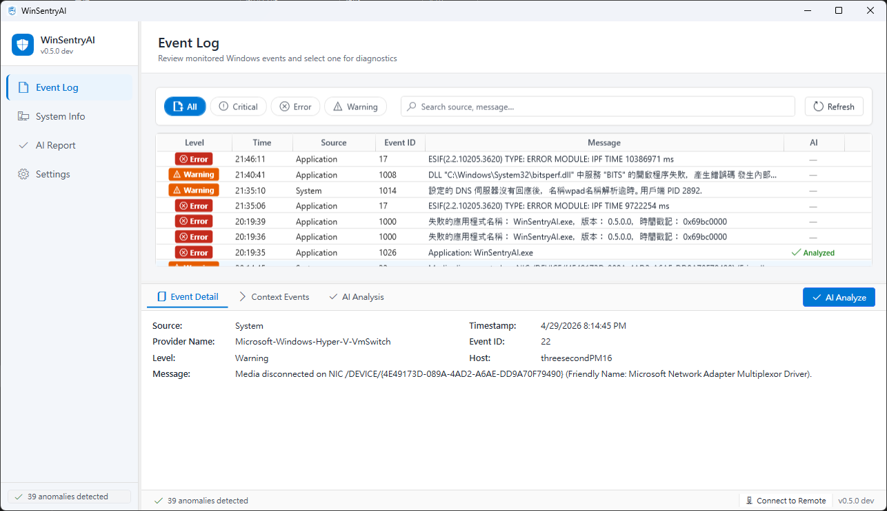
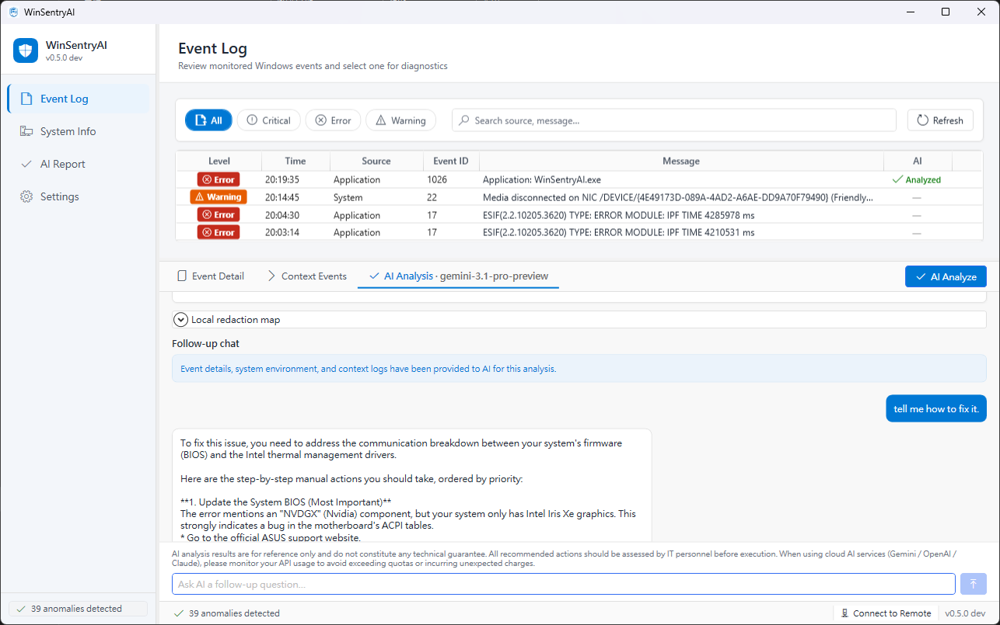
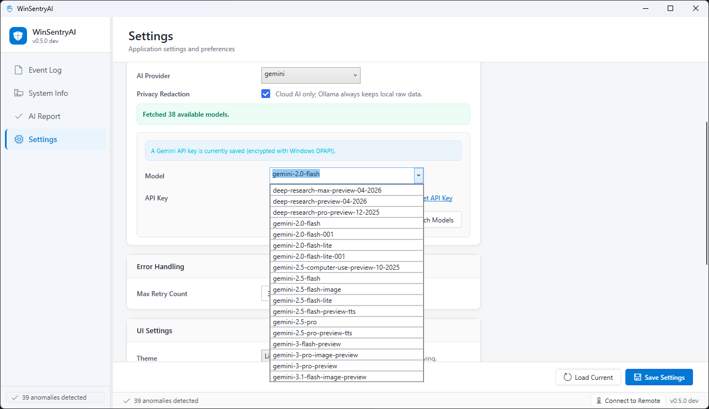
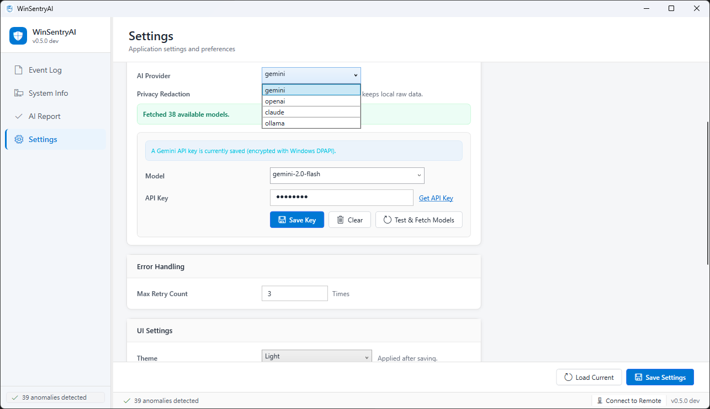

# WinSentryAI

**WinSentryAI** 是一款可攜式 Windows 桌面診斷工具，用來檢視 Windows 事件記錄，並透過 AI 協助 IT 操作人員理解系統異常。

目前版本：**v0.9**  
狀態：**release candidate**

語言：[English](README.md) | [繁體中文](README.zh-TW.md) | [简体中文](README.zh-CN.md)

## 軟體介紹

WinSentryAI 針對實務 Windows 疑難排解流程設計，會整合事件記錄、系統資訊快照、相關上下文事件，以及選用的 AI 分析，提供桌面化診斷工作流程。

它的目標是協助 IT 人員更快理解問題，但實際修復決策仍由操作人員自行判斷。

## 主要功能

- Windows 事件記錄回溯載入與本機監控
- 事件篩選、搜尋、詳細資訊與上下文事件擷取
- 針對選取事件執行 AI 分析與 follow-up chat
- 支援 Gemini、OpenAI、Claude、Ollama 的 Bring Your Own Key 模式
- 雲端 AI prompt 隱私遮蔽
- 系統資訊快照
- 遠端 Windows 事件記錄回溯查詢
- 系統匣行為與 single-instance 啟動處理
- English、繁體中文、简体中文 UI
- Light、Dark、System 佈景選項

## 截圖

事件日誌頁面可讓操作人員篩選 Windows 事件、檢視事件詳細內容，並從選取的事件啟動 AI 分析。

AI 分析頁面提供聚焦於事件的說明，並可透過 follow-up chat 追問實務修復方向。

設定頁可使用已設定的 API key 取得可用 Gemini 模型，並選擇分析時使用的模型。

AI provider 設定支援 Gemini、OpenAI、Claude、Ollama，並提供本機隱私遮蔽選項。

## 文件

操作細節集中在使用手冊：

- [User Manual](Docs/user-manual.md)
- [使用手冊（繁體中文）](Docs/user-manual.zh-TW.md)
- [用户手册（简体中文）](Docs/user-manual.zh-CN.md)
- [隱私政策](PRIVACY.md)
- [安全政策](SECURITY.md)
- [程式碼簽章政策](CODE_SIGNING_POLICY.md)
- [第三方套件授權聲明](THIRD_PARTY_NOTICES.md)

使用手冊包含安裝需求、build 與執行方式、API key 設定、AI provider 免費/付費限制、遠端連線設定、系統匣行為、佈景設定、已知限制與疑難排解注意事項。

## 使用範圍

WinSentryAI 只提供診斷輔助。它不會自動修復系統、不會修改事件記錄，也不會依照 AI 輸出自動執行修復指令。

採取任何處置前，AI 分析結果都應由合格 IT 人員自行判斷。

## 授權

WinSentryAI 採用 [MIT License](LICENSE) 授權。
